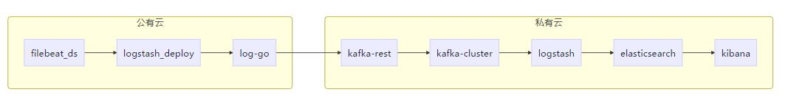

# kubernetes 日志管理部署手册 ###


## 日志传输路径



<p>公有云集群模拟环境内的filebeat以deamon形式部署，logstash和log-go以deployment形式部署。
<br>私有云内的模拟环境目前时以二进制部署。
</p>


## 部署手册


### 公有云

#### log-go部署
1. 安装go(步骤省略)
2. 拷贝log_kafka.go到GOPATH目录，并编译。
```
# GOPATH=$(go env GOPATH)
# cd $GOPATH
# CGO_ENABLED=0 GOOS=linux go build log_kafka.go

```
3. 制作log_kafka镜像，并分发，目前镜像是手动分发。

```
# cat > Dockerfile <<EOF
FROM busybox:latest 
COPY log_kafka /
ENV  KAFKA_REST_HOST="192.168.3.166" KAFKA_REST_PORT="8082" KAFKA_REST_TOPIC="test"
EXPOSE 8080
CMD [ "/log_kafka" ]
EOF

# docker build ./ -t log_kafka:0.1

```
4. 创建log-go服务。
```
# kubectl create -f elasticsearch-ns.yaml
# kubectl create -f log_kafka_deploy.yaml
```

#### logstash部署
```
# kubectl create -f logstash.yaml
```

#### filebeat部署
```
# kubectl create -f filebeat-to-logstash.yaml
```

### 私有云

#### kafka-rest部署
参照[kafka集群部署手册](./kafka集群部署.md)

#### kafka-rest部署
参照[kafka-rest部署手册](./kafka-rest部署.md)

#### ELK部署
参照[ELK部署手册](./ELK部署.md)

